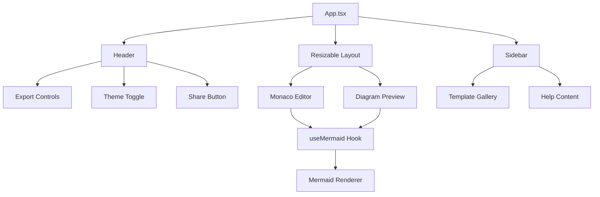
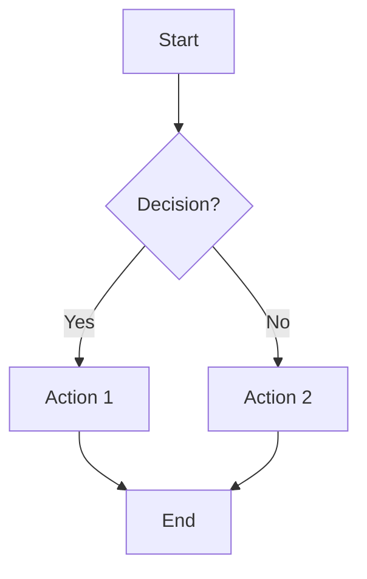

# 🧜‍♀️ MermaidDraw

<div align="center">

**A modern, production-ready Mermaid diagram editor with real-time preview**


[Live Demo](https://mermaiddraw-demo.netlify.app) • [Features](#-features) • [Quick Start](#-quick-start) • [Documentation](#-documentation)

</div>

---

## ✨ Features

### 🎯 Core Functionality
- **Real-time Preview** - See your diagrams render as you type with 500ms debounced updates
- **Monaco Editor** - VS Code-like editing experience with Mermaid syntax support
- **Export System** - High-quality PNG, vector SVG, and PDF export with theme-aware backgrounds
- **URL Sharing** - Generate compressed shareable links with LZ-String compression
- **Template Gallery** - Pre-built examples for all supported Mermaid diagram types

### 🎨 User Experience  
- **Responsive Design** - Works seamlessly across desktop, tablet, and mobile devices
- **Theme Support** - Beautiful light and dark modes with automatic persistence
- **Resizable Layout** - Adjustable split-pane interface with smooth transitions
- **Zoom Controls** - Pan and zoom diagrams with precision controls
- **Auto-save** - Your work is automatically preserved in local storage

### 🔧 Developer Experience
- **TypeScript** - Full type safety throughout the application
- **Performance Optimized** - Debounced rendering, lazy loading, and efficient re-renders
- **Modern Architecture** - Custom hooks, modular components, clean separation of concerns
- **Error Handling** - Comprehensive error boundaries with user-friendly messages

## 🚀 Quick Start

### Prerequisites
- Node.js 18+ or Bun
- Modern web browser

### Installation

```bash
# Clone the repository
git clone https://github.com/yourusername/mermaid-live.git
cd mermaid-live

# Install dependencies (using Bun - recommended)
bun install

# Or with npm
npm install

# Start development server
bun run dev
# Server will be available at http://localhost:5173
```

### Build for Production

```bash
# Build optimized bundle
bun run build

# Preview production build
bun run preview

# Lint code
bun run lint
```

## 📊 Supported Diagrams

| Type | Description | Status |
|------|-------------|--------|
| 🔄 **Flowchart** | Process flows, decision trees | ✅ |
| 📈 **Sequence** | Actor interactions over time | ✅ |
| 📅 **Gantt** | Project timelines and schedules | ✅ |
| 🏛️ **Class** | Object-oriented system design | ✅ |
| 🔄 **State** | State machines and transitions | ✅ |
| 🥧 **Pie Chart** | Data visualization | ✅ |
| 🌳 **Git Graph** | Version control flows | ✅ |
| 👤 **User Journey** | UX mapping and workflows | ✅ |
| 🗃️ **Entity Relationship** | Database design | ✅ |

## 🏗️ Architecture



### Key Components

- **`useMermaid`** - Core diagram rendering and theme management
- **`useLocalStorage`** - Persistent state management
- **`useDebounce`** - Performance optimization for real-time updates
- **`useToast`** - User notification system

## 🛠️ Technology Stack

### Frontend Framework
- **React 19.1.0** with hooks and functional components
- **TypeScript 5.7** for type safety and developer experience
- **Vite 5.4** for lightning-fast development and optimized builds

### UI & Styling
- **Tailwind CSS 3.4** for utility-first styling
- **Lucide React** for consistent, beautiful icons
- **React Resizable Panels** for smooth layout management

### Core Libraries
- **Mermaid.js 11.8** for diagram rendering
- **Monaco Editor** for code editing experience
- **html2canvas & jsPDF** for export functionality
- **LZ-String** for URL compression

## 📚 Documentation

### Usage Guide

1. **Create Diagrams** - Write Mermaid syntax in the left editor panel
2. **Real-time Preview** - Watch your diagram update automatically on the right
3. **Use Templates** - Access pre-built examples via the sidebar menu
4. **Export Options** - Download as PNG, SVG, or PDF using the export dropdown  
5. **Share Work** - Generate compressed URLs to share diagrams with others
6. **Customize View** - Toggle themes and adjust zoom for optimal viewing

### Example Diagram



## 🤝 Contributing

We welcome contributions! Please see our contributing guidelines:

1. Fork the repository
2. Create a feature branch (`git checkout -b feature/amazing-feature`)
3. Make your changes with tests
4. Commit changes (`git commit -m 'feat: add amazing feature'`)
5. Push to branch (`git push origin feature/amazing-feature`)
6. Open a Pull Request

### Development Scripts

```bash
bun run dev       # Development server
bun run build     # Production build  
bun run preview   # Preview build
bun run lint      # ESLint check
```

## 📄 License

This project is licensed under the MIT License - see the [LICENSE](LICENSE) file for details.

## 🙏 Acknowledgments

- **[Mermaid.js](https://mermaid.js.org/)** - The powerful diagramming library
- **[Monaco Editor](https://microsoft.github.io/monaco-editor/)** - VS Code's editor for the web
- **[React Team](https://reactjs.org/)** - The amazing UI framework
- **[Tailwind CSS](https://tailwindcss.com/)** - Beautiful, utility-first styling

---

<div align="center">

**Built with ❤️ for the developer community**

[⭐ Star this repo](https://github.com/yourusername/mermaid-live) • [🐛 Report Bug](https://github.com/yourusername/mermaid-live/issues) • [💡 Request Feature](https://github.com/yourusername/mermaid-live/issues)

</div>